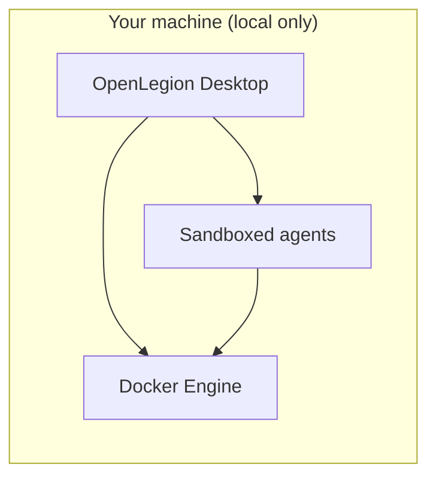

# OpenLegion

**Local desktop platform for running Docker workloads with sandboxed, security-aware agents.**

OpenLegion helps **DevOps engineers** and **security teams** design container images safely, spin up multiple containers, and get guided help from AI agents—without sending your environment to the cloud. Think **Docker Desktop**, but oriented toward secure defaults, clearer workflows, and agents that understand your compose files, Dockerfiles, and runtime posture.

Everything runs **on your machine**. There is no hosted control plane; data, credentials, and workloads stay local.

[](https://github.com/dorman/OpenLegion/actions/workflows/publish.yml)

---

## Who this is for

| Audience | What you get |
|----------|----------------|
| **DevOps engineers** | A desktop surface to run and manage many containers, with agents that help author Dockerfiles, Compose stacks, and run/debug commands in context. |
| **Security teams** | Workflows that bias toward least privilege, explicit approvals, and reviewable changes before images or containers go live on a laptop or lab host. |

OpenLegion is **not** a SaaS product. It is a **local-only** management and agent platform you install and run yourself.

---

## The product vision



1. **Desktop-first** — Primary experience is the Electron app (`bun run dev:desktop`): see containers, projects, and agent sessions in one place.
2. **Many containers** — Run and manage multiple Docker containers (and stacks) from that UI, similar in spirit to Docker Desktop but with agent-assisted flows.
3. **Agents that help** — Sandboxed agents assist with writing Dockerfiles, hardening images, explaining `docker`/`compose` output, and proposing fixes—always subject to permission rules and your approval.
4. **Security by design** — Agents run with constrained scope; risky operations require confirmation. The goal is secure **design** and **bring-up**, not unconstrained shell access on the host.

Branding uses a Robin Hood motif: defend operators and workloads against opaque, insecure defaults—give teams control on their own hardware.

---

## What exists today vs. what we are building

This repo is a **fork of [OpenCode](https://github.com/anomalyco/opencode)**. The agent runtime, permissions model, desktop shell, and HTTP API are largely in place; **Docker-centric management UI and container-native agent tools are the main work ahead.**

### Available now

| Component | Command / location | Notes |
|-----------|-------------------|--------|
| **Desktop app** | `bun run dev:desktop` | Electron UI—foundation for the management platform |
| **CLI / TUI** | `bun run dev` | Terminal agent (upstream OpenCode behavior) |
| **Web UI** | `bun run dev:web` | Same app shell in the browser for development |
| **Agent runtime** | `packages/openlegion` | Sessions, tools, providers, MCP, plugins |
| **Permissions** | `~/.openlegion` | Gates for files, shell, and tools |
| **Built-in agents** | TUI: **Tab** to switch | `build`, `plan` (read-only + asks before shell), `general` (`@general`) |

Config and state: **`~/.openlegion/`** (global), optional **`.openlegion/`** per repo. See [`.openlegion/`](./.openlegion/) for sample agents and commands.

### Roadmap (product focus)

- [ ] **Docker integration in desktop** — list/start/stop containers and compose projects from the UI
- [ ] **Multi-container workspace** — run several stacks side by side with clear isolation boundaries
- [ ] **Sandboxed agent execution** — agents scoped to container filesystem/network context where possible
- [ ] **Secure image workflows** — guided Dockerfile/Compose authoring, baseline hardening checks, explain-before-run
- [ ] **Security-team views** — audit-friendly session logs and policy hints for common misconfigurations

The [`packages/containers`](./packages/containers/) directory is **CI build images** for GitHub Actions only—not the end-user runtime.

---

## How it compares

| | Docker Desktop | OpenLegion (target) |
|---|----------------|---------------------|
| **Runs where** | Local | **Local only** |
| **Primary goal** | Run containers | Run containers **and** help secure/design them with agents |
| **AI assistance** | Limited / separate tools | **Built-in**, permissioned, sandboxed agents |
| **Audience** | General developers | **DevOps + security** teams |

---

## Requirements

- [Bun](https://bun.sh) **1.3.14+**
- [Docker](https://docs.docker.com/get-docker/) (for upcoming container features; install now if you plan to contribute)
- macOS, Linux, or Windows (desktop development is most tested on **macOS** today)

---

## Quick start

```bash
git clone https://github.com/dorman/OpenLegion.git
cd OpenLegion
bun install

# Management desktop (primary product direction)
bun run dev:desktop

# Terminal agent (also useful for debugging)
bun run dev
```

Future CLI install (when published): `npm i -g openlegion-ai`.

---

## Agents and security

Agents inherit OpenCode’s model and will tighten for container work:

| Agent | Role |
|-------|------|
| **build** | Implementation agent—edits and commands allowed per your permission config |
| **plan** | Read-only analysis—ideal for reviewing Dockerfiles and compose before changes |
| **general** | Multi-step search subagent (`@general` in prompts) |

**Security direction:** default-deny tooling, explicit approval for shell and deploy actions, sandboxed context per container/project, and local-only storage of secrets and session history—no telemetry requirement for core use.

---

## Monorepo layout

```
packages/
  openlegion/     # CLI, TUI, local HTTP server, agent + tool runtime
  core/           # Shared logic (permissions, DB, providers, …)
  app/            # SolidJS UI (used inside desktop)
  desktop/        # Electron management shell
  ui/             # Components and brand assets
  plugin/         # Plugin SDK
  sdk/            # JS client for the local API
  containers/     # CI images only (not the product runtime)
```

Default branch: **`dev`**. Conventions: [AGENTS.md](./AGENTS.md), contributions: [CONTRIBUTING.md](./CONTRIBUTING.md).

---

## Configuration

| Path | Purpose |
|------|---------|
| `~/.openlegion/` | Global settings, auth, custom agents/commands |
| `.openlegion/` | Per-project overrides |

Environment variables: `OPENLEGION_*` prefix (e.g. `OPENLEGION_BIN_PATH`).

---

## Development

| Command | Description |
|---------|-------------|
| `bun run dev:desktop` | Desktop management app |
| `bun run dev` | CLI / TUI agent |
| `bun run dev:web` | Web UI dev server |
| `bun run lint` | Oxlint |
| `bun run typecheck` | Turbo typecheck |

Regenerate app icons after updating `packages/ui/src/assets/brand/openlegion-icon.png`:

```bash
cd packages/desktop
bun ./scripts/generate-brand-icons.ts
bun ./scripts/copy-icons.ts dev
```

---

## Fork lineage

OpenLegion forks [OpenCode](https://github.com/anomalyco/opencode) and diverges toward **local Docker management + security agents**. It is not affiliated with Docker Inc. or the OpenCode team. Third-party projects with “opencode” in the name are unrelated.

MIT — see [LICENSE](./LICENSE). Upstream OpenCode remains MIT; attribution appreciated.

---

## Contributing

Security, Docker, and desktop UX contributions are especially welcome. Read [CONTRIBUTING.md](./CONTRIBUTING.md). Commit format: `type(scope): summary` (e.g. `feat(desktop): list running containers`).
