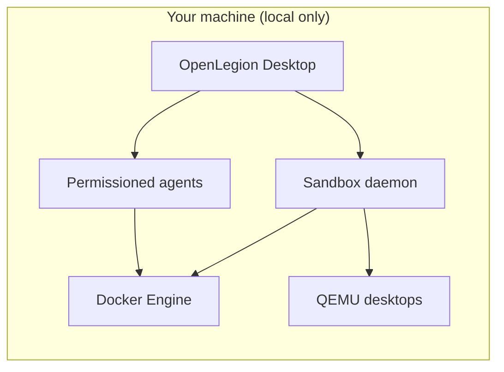

# OpenLegion
[](https://dl.circleci.com/status-badge/redirect/circleci/4HpVvw2oM8fo29s68vV2LJ/7XT7kXBPD4uR5GD5zFRxDT/tree/dev)
[](https://snyk.io/test/github/{dorman}/{openlegion})


**Local desktop platform for running sandboxes—Docker containers and Linux desktop VMs—with permissioned AI agents.**

OpenLegion gives **DevOps engineers** and **security teams** a single place on their own machine to spin up isolated workloads, inspect them (logs, shell, or live desktop), and get guided help from sandboxed agents. No cloud control plane: your images, credentials, sessions, and runtime stay local.

OpenLegion is a fork of [OpenCode](https://github.com/anomalyco/opencode) that diverges toward **local sandbox management + security-aware agents**. It is not affiliated with Docker Inc. or OpenCode. Third-party projects with “opencode” in the name are also unrelated.

MIT — see [LICENSE](./LICENSE). Upstream OpenCode remains MIT; attribution appreciated.

---

Everything runs **on your machine**. There is no hosted control plane; data, credentials, and workloads stay local.

### Screenshots

**Sandboxes page** — create and manage container and desktop workloads, check local runtime status, and start the sandbox daemon from one place.


**Desktop VM display** — inspect a sandbox, then open a live Linux desktop over VNC in the app (no separate viewer required).


Screenshots are maintained manually — see [docs/screenshots/README.md](./docs/screenshots/README.md) when refreshing product imagery after UI changes.

---

## Who this is for

| Audience             | What you get                                                                                                                                        |
| -------------------- | --------------------------------------------------------------------------------------------------------------------------------------------------- |
| **DevOps engineers** | A desktop app to run many sandboxes side by side, with agents that help author Dockerfiles, debug runtime output, and work inside mapped workspaces. |
| **Security teams**   | Workflows that bias toward least privilege, explicit approvals, isolated networks, and reviewable changes before workloads go live on a lab host.   |

OpenLegion is **not** a SaaS product. It is a **local-only** management and agent platform you install and run yourself.

---

## What OpenLegion does



1. **Desktop-first** — The Electron app (`bun run dev:desktop`) is the primary surface: **Sandboxes**, **Agents**, and **Settings** in one shell.
2. **Two workload types** — Run **container** sandboxes (images, ports, bind mounts) or **Linux desktop** sandboxes (curated distro ISOs or custom qcow2 via QEMU) from the same UI.
3. **Isolated runtimes** — The `openlegion-microvm` daemon can place Docker workloads on per-sandbox networks and host QEMU VMs with persisted disks under `~/.openlegion/`.
4. **Inspect everything** — Logs, embedded shell (containers), and in-app VNC desktop view (QEMU workloads) without leaving the app.
5. **Agents inside sandboxes** — Link a host project directory into a container sandbox and run an agent session whose file and shell tools execute **inside** the workload, gated by OpenLegion’s permission model.
6. **Security by design** — Default-deny tooling, explicit approval for risky operations, and local-only storage of secrets and session history.

---

## What exists today

This repo is a **fork of [OpenCode](https://github.com/anomalyco/opencode)**. The agent runtime, permissions model, desktop shell, and HTTP API are in place. **Sandbox management, the sandbox daemon, and in-workload agent tools are implemented** on the path to the full secure-local-workstation vision.

### Available now

| Component | Command / location | Notes |
| --- | --- | --- |
| **Desktop app** | `bun run dev:desktop` | Electron UI; desktop builds open on **Sandboxes** by default |
| **Sandboxes UI** | Desktop → **Sandboxes** | Onboarding, runtime pills, create dialog (workload / installer / runtime / general sections), inspect, agent sessions |
| **Sandbox daemon** | `go run ./cmd/openlegion-microvm` | Isolated Docker networks + QEMU desktop VMs ([daemon README](./cmd/openlegion-microvm/README.md)) |
| **Desktop auto-start** | Desktop app launch | Starts the sandbox daemon when possible; **Start sandbox daemon** if it is offline |
| **Container runtime** | `packages/openlegion/src/container/` | Auto-detects sandbox daemon, Docker, or Podman (`OPENLEGION_CONTAINER_RUNTIME`) |
| **Container HTTP API** | `GET/POST /global/containers` | List, create, start, stop, and remove sandboxes via the local sidecar |
| **Container workspaces** | `GET/PUT /global/container-workspaces` | Persist bind mounts and session links per sandbox |
| **Container CLI** | `openlegion container list\|create\|stop\|remove` | Manage workloads from the terminal |
| **CLI / TUI** | `bun run dev` | Terminal agent (upstream OpenCode behavior) |
| **Web UI** | `bun run dev:web` | Same app shell in the browser for development |
| **Agent runtime** | `packages/openlegion` | Sessions, tools, providers, MCP, plugins |
| **Permissions** | `~/.openlegion` | Gates for files, shell, and tools |
| **Built-in agents** | TUI: **Tab** to switch | `build`, `plan` (read-only + asks before shell), `general` (`@general`) |

Config and state: **`~/.openlegion/`** (global), optional **`.openlegion/`** per repo. See [`.openlegion/`](./.openlegion/) for sample agents and commands.

### Sandbox features

| Feature | Description |
| --- | --- |
| **Create container sandboxes** | Desktop dialog or CLI—image, name, command, ports, bind mounts |
| **Create desktop sandboxes** | `kind: desktop` with a curated installer ISO (Ubuntu, Debian, Fedora, Rocky, AlmaLinux — filtered by host arm64/amd64; see [desktop presets](./packages/app/src/utils/desktop-presets.ts)) or a custom qcow2/ISO; installer images cache under `~/.openlegion/images`, VM disks under `~/.openlegion/qemu-vms` |
| **Isolated networks** | Sandbox daemon places Docker workloads on dedicated networks (`network: isolated` in the UI) |
| **Start stopped workloads** | Restart stopped containers and desktop VMs from the UI or `POST /global/containers/:id/start` |
| **Logs, shell & desktop** | Inspect dialog with **Logs**, **Shell**, and **Desktop** tabs; live VNC for QEMU workloads |
| **Runtime status** | Docker, sandbox daemon, and QEMU availability shown in onboarding and on the sandboxes page |
| **Open agent session** | Bind a host project into a container sandbox and start/resume an agent with `openlegion.container` metadata |
| **In-sandbox file tools** | When a session has container metadata, `read`, `write`, and `edit` run inside the workload via `docker exec` |
| **In-sandbox shell** | Shell tool wraps commands in `docker exec` for linked sessions |
| **Workload badges** | Container vs desktop sandboxes shown with distinct pill styling in the UI |
| **Container workspaces** | Stored in `~/.openlegion/data/container-workspaces.json` |

### Desktop UI

- **Sandboxes page** — card layout with workload type and running/stopped pills, isolated-network label, and actions (open session, inspect, start, stop, remove)
- **Onboarding** — guided setup for daemon readiness, first sandbox creation, and inspect/session workflow
- **Create sandbox dialog** — sectioned form for workload type, desktop installer presets, runtime options, and general settings
- **Inspect sandbox** — modal with **Logs**, **Shell**, and **Desktop** tabs; live VNC for QEMU desktop sandboxes
- **Agents page** — recent agent sessions (`/agents`)
- **Settings** — in-app settings dialog from the sidebar
- **Dev builds** — channel badge and app version in the titlebar
- **Theme** — dark charcoal shell with green accents, orange agent-session highlights, and monospace typography on desktop. The Electron chrome is **dark-only by design** (no light desktop theme); the in-app settings theme still applies inside agent sessions on web/desktop builds.

### Roadmap

- [x] **Compose project management** — basic deploy/stop from a compose file on the Sandboxes page
- [x] **Multi-sandbox workspaces** — tabbed panel when multiple sandboxes are running
- [x] **Project sandboxes** — linked project paths shown in the desktop sidebar
- [ ] **Secure image workflows** — guided Dockerfile/Compose authoring, baseline hardening checks, explain-before-run (basic hardening hints in create dialog today)
- [x] **Security-team views** — audit tab in inspect dialog for local sandbox permission events

The [`packages/containers`](./packages/containers/) directory is **CI build images** for GitHub Actions only—not the end-user runtime.

---

## How it compares

|                   | Docker Desktop           | OpenLegion (today)                                         |
| ----------------- | ------------------------ | ---------------------------------------------------------- |
| **Runs where**    | Local                    | **Local only**                                             |
| **Primary goal**  | Run containers           | Run **sandboxes** (containers + desktop VMs) **with agents** |
| **AI assistance** | Limited / separate tools | **Built-in**, permissioned, sandbox-scoped agents          |
| **Audience**      | General developers       | **DevOps + security** teams                                |

---

## Requirements

- [Bun](https://bun.sh) **1.3.14+**
- [Docker](https://docs.docker.com/get-docker/) (or Podman) for container sandboxes — on macOS, [Colima](https://github.com/abiosoft/colima) is a common local Docker backend
- [QEMU](https://www.qemu.org/) (`brew install qemu`) for desktop sandboxes on macOS
- [Go](https://go.dev) **1.22+** (to build/run the sandbox daemon locally)
- macOS, Linux, or Windows (desktop development is most tested on **macOS** today; icon regeneration in `predev` uses macOS `sips`/`iconutil` — Linux/Windows dev builds use committed icons under `packages/desktop/icons/`)

---

## Quick start

```bash
git clone https://github.com/dorman/OpenLegion.git
cd OpenLegion
bun install

# Management desktop (primary product)
bun run dev:desktop

# Terminal agent (also useful for debugging)
bun run dev

# Optional: sandbox daemon (isolated Docker networks + QEMU desktops)
# The desktop app can also start this from Sandboxes → Start sandbox daemon
go run ./cmd/openlegion-microvm

# macOS: ensure Docker and QEMU are available
colima start          # if you use Colima for Docker
brew install qemu     # for desktop sandboxes

# Sandbox CLI (with local server or daemon running)
bun run dev -- container list
```

Future CLI install (when published): `npm i -g openlegion-ai`.

---

## Agents and security

Agents inherit OpenCode’s model and tighten for sandbox work:

| Agent       | Role                                                                          |
| ----------- | ----------------------------------------------------------------------------- |
| **build**   | Implementation agent—edits and commands allowed per your permission config    |
| **plan**    | Read-only analysis—ideal for reviewing Dockerfiles and compose before changes |
| **general** | Multi-step search subagent (`@general` in prompts)                            |

When a session is linked to a container sandbox (`openlegion.container` metadata), file and shell tools operate **inside the workload** at the mapped workspace path. Permission prompts include sandbox id and runtime context.

**Security direction:** default-deny tooling, explicit approval for shell and deploy actions, sandbox-scoped agent context, and local-only storage of secrets and session history—no telemetry requirement for core use.

---

## Monorepo layout

```
cmd/
  openlegion-microvm/   # Go sandbox daemon (isolated Docker networks + QEMU desktops)
internal/               # Daemon engine, Docker client, QEMU sandbox, VNC display bridge
packages/
  openlegion/           # CLI, TUI, local HTTP server, agent + tool runtime
  core/                 # Shared logic (permissions, DB, providers, …)
  app/                  # SolidJS UI (sandboxes page, desktop shell, dialogs)
  desktop/              # Electron management shell + sandbox runtime IPC
  ui/                   # Components and brand assets
  plugin/               # Plugin SDK
  sdk/                  # JS client for the local API
  containers/           # CI images only (not the product runtime)
```

Default branch: **`dev`**. Conventions: [AGENTS.md](./AGENTS.md), contributions: [CONTRIBUTING.md](./CONTRIBUTING.md).

---

## Configuration

| Path             | Purpose                                       |
| ---------------- | --------------------------------------------- |
| `~/.openlegion/` | Global settings, auth, custom agents/commands |
| `.openlegion/`   | Per-project overrides                         |

Environment variables: `OPENLEGION_*` prefix. Sandbox-related examples:

| Variable | Purpose |
| --- | --- |
| `OPENLEGION_CONTAINER_RUNTIME` | Prefer `microvm`, `docker`, or `podman` |
| `OPENLEGION_MICROVM_URL` | Sandbox daemon URL (default `http://127.0.0.1:7420`) |
| `OPENLEGION_MICROVM_LISTEN` | Daemon listen address |
| `OPENLEGION_SANDBOX_ROOT` | Sandbox metadata directory (default `~/.openlegion/sandboxes`) |
| `OPENLEGION_QEMU_IMAGE` | Path to Ubuntu arm64 ISO or qcow2 for `kind: desktop` |
| `OPENLEGION_QEMU_ROOT` | Desktop VM disks (default `~/.openlegion/qemu-vms`) |
| `OPENLEGION_QEMU_MEMORY_MB` | RAM for desktop sandboxes (default `2048`) |

---

## Development

| Command               | Description            |
| --------------------- | ---------------------- |
| `bun run dev:desktop` | Desktop management app |
| `bun run dev`         | CLI / TUI agent        |
| `bun run dev:web`     | Web UI dev server      |
| `bun run lint`        | Oxlint                 |
| `bun run typecheck`   | Turbo typecheck        |

Regenerate app icons after updating `packages/ui/src/assets/brand/openlegion-mark.png` (macOS only):

```bash
cd packages/desktop
bun ./scripts/generate-brand-icons.ts
bun ./scripts/copy-icons.ts dev
```

On macOS, `bun run dev:desktop` also regenerates icons and clears the Vite cache on cold start so logo changes are picked up.

## Contributing

Security, sandbox, and desktop UX contributions are especially welcome. Read [CONTRIBUTING.md](./CONTRIBUTING.md). Commit format: `type(scope): summary` (e.g. `feat(desktop): polish sandboxes onboarding`).
