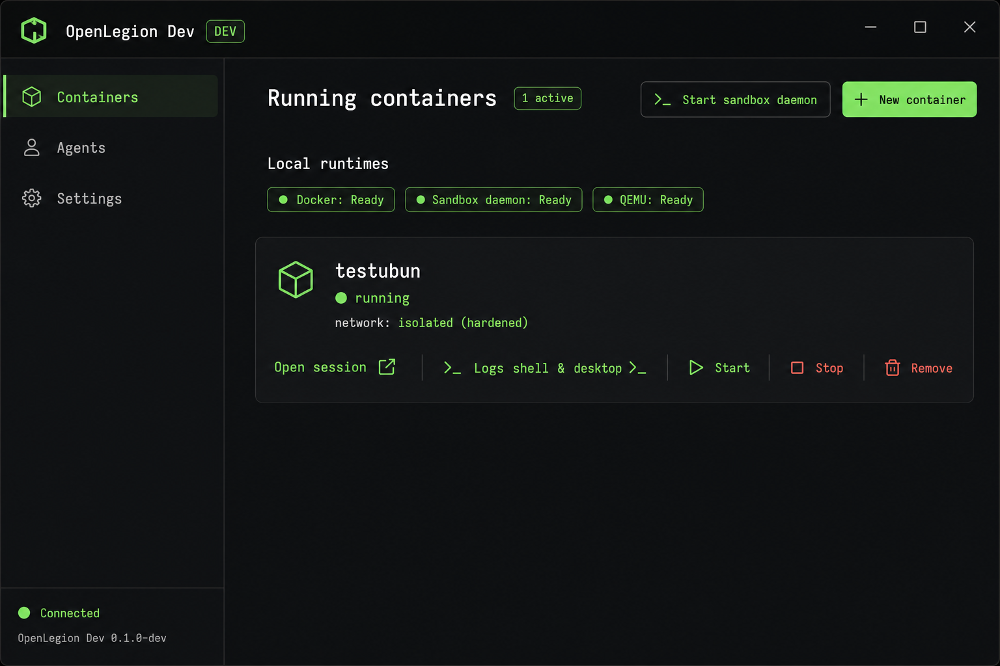
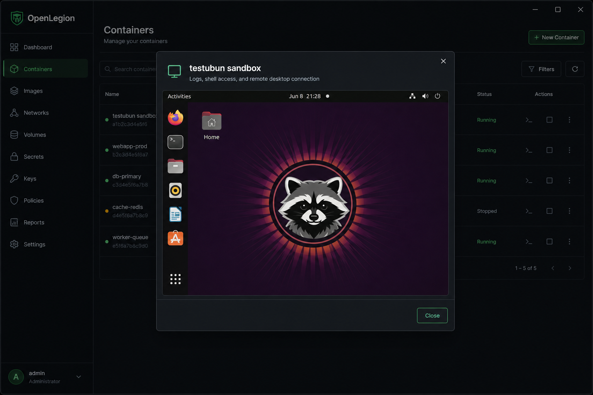
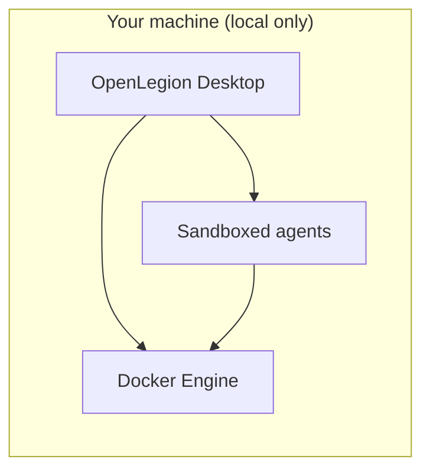

# OpenLegion
[](https://dl.circleci.com/status-badge/redirect/circleci/4HpVvw2oM8fo29s68vV2LJ/7XT7kXBPD4uR5GD5zFRxDT/tree/dev)


**Local desktop platform for running Docker workloads with sandboxed, security-aware agents.**

OpenLegion helps **DevOps engineers** and **security teams** design container images safely, spin up multiple containers, and get guided help from AI agents—without sending your environment to the cloud. Think **Docker Desktop**, but oriented toward secure defaults, clearer workflows, and agents that understand your compose files, Dockerfiles, and runtime posture.

OpenLegion is fork of [OpenCode](https://github.com/anomalyco/opencode) and diverges toward **local Docker management + security agents**. It is not affiliated with Docker Inc. or OpenCode. Third-party projects with “opencode” in the name are also unrelated.

MIT — see [LICENSE](./LICENSE). Upstream OpenCode remains MIT; attribution appreciated.

---

Everything runs **on your machine**. There is no hosted control plane; data, credentials, and workloads stay local.

### Screenshots

**Containers page** — manage Docker and QEMU desktop workloads, check runtime status, and start the sandbox daemon from one place.



**Desktop VM display** — inspect a sandbox, then open a live Linux desktop over VNC in the app (no separate viewer required).



---

## Who this is for

| Audience             | What you get                                                                                                                                        |
| -------------------- | --------------------------------------------------------------------------------------------------------------------------------------------------- |
| **DevOps engineers** | A desktop surface to run and manage many containers, with agents that help author Dockerfiles, Compose stacks, and run/debug commands in context.   |
| **Security teams**   | Workflows that bias toward least privilege, explicit approvals, and reviewable changes before images or containers go live on a laptop or lab host. |

OpenLegion is **not** a SaaS product. It is a **local-only** management and agent platform you install and run yourself.

---

## The product vision



1. **Desktop-first** — Primary experience is the Electron app (`bun run dev:desktop`): manage containers, open agent sessions, and review recent work in one place.
2. **Many containers** — List, create, start, stop, and remove Docker workloads from the desktop UI or CLI, with optional per-workload network isolation via the sandbox daemon.
3. **Linux desktop VMs** — Launch QEMU desktop sandboxes (Ubuntu ISO or qcow2), view them in-app over VNC, and restart stopped VMs without recreating disks.
4. **Agents that help** — Sandboxed agents assist with writing Dockerfiles, hardening images, explaining `docker`/`compose` output, and proposing fixes—always subject to permission rules and your approval.
5. **Security by design** — Linked sessions run file and shell tools inside the container; risky operations require confirmation. The goal is secure **design** and **bring-up**, not unconstrained host access.

Branding uses a Robin Hood motif: defend operators and workloads against opaque, insecure defaults—give teams control on their own hardware.

---

## What exists today vs. what we are building

This repo is a **fork of [OpenCode](https://github.com/anomalyco/opencode)**. The agent runtime, permissions model, desktop shell, and HTTP API are in place. **Container management, sandbox runtimes, and in-container agent tools are now implemented** on the path to the full Docker Desktop + security-agent vision.

### Available now

| Component | Command / location | Notes |
| --- | --- | --- |
| **Desktop app** | `bun run dev:desktop` | Electron UI with Containers, Agents, and Settings navigation |
| **Containers UI** | Desktop → **Containers** | List running/stopped workloads, create containers, inspect logs/shell/desktop, open agent sessions |
| **Sandbox daemon** | `go run ./cmd/openlegion-microvm` | Isolated Docker networks + QEMU desktop VMs ([daemon README](./cmd/openlegion-microvm/README.md)) |
| **Desktop auto-start** | Desktop app launch | Starts the sandbox daemon when possible; **Start sandbox daemon** button if it is offline |
| **Container runtime** | `packages/openlegion/src/container/` | Auto-detects microvm daemon, Docker, or Podman (`OPENLEGION_CONTAINER_RUNTIME`) |
| **Container HTTP API** | `GET/POST /global/containers` | List, create, start, stop, and remove containers via the local sidecar |
| **Container workspaces** | `GET/PUT /global/container-workspaces` | Persist bind mounts and session links per container |
| **Container CLI** | `openlegion container list\|create\|stop\|remove` | Manage workloads from the terminal |
| **CLI / TUI** | `bun run dev` | Terminal agent (upstream OpenCode behavior) |
| **Web UI** | `bun run dev:web` | Same app shell in the browser for development |
| **Agent runtime** | `packages/openlegion` | Sessions, tools, providers, MCP, plugins |
| **Permissions** | `~/.openlegion` | Gates for files, shell, and tools |
| **Built-in agents** | TUI: **Tab** to switch | `build`, `plan` (read-only + asks before shell), `general` (`@general`) |

Config and state: **`~/.openlegion/`** (global), optional **`.openlegion/`** per repo. See [`.openlegion/`](./.openlegion/) for sample agents and commands.

### Container & sandbox features

| Feature | Description |
| --- | --- |
| **Create containers** | Desktop dialog or CLI—image, name, command, ports, bind mounts |
| **Create desktop VMs** | `kind: desktop` with Ubuntu arm64 ISO (Apple Silicon) or qcow2 disk; persisted under `~/.openlegion/qemu-vms` |
| **Isolated sandboxes** | `openlegion-microvm` places each Docker workload on its own network (`network: isolated (hardened)` in the UI) |
| **Start stopped workloads** | Restart stopped containers and desktop VMs from the UI or `POST /global/containers/:id/start` |
| **Logs, shell & desktop** | Inspect dialog with log tail, embedded shell (containers), and noVNC desktop view (QEMU workloads) |
| **Runtime status** | Desktop shows Docker, sandbox daemon, and QEMU availability before you create workloads |
| **Open agent session** | Bind a host project directory into a container and start/resume an agent session with `openlegion.container` metadata |
| **In-container file tools** | When a session has container metadata, `read`, `write`, and `edit` run inside the container via `docker exec` (not on the host) |
| **In-container shell** | Shell tool wraps commands in `docker exec` for sandboxed sessions |
| **Session sandbox badge** | Session header shows when a session is linked to a container |
| **Container workspaces** | Stored in `~/.openlegion/data/container-workspaces.json` |
| **Runtime status** | Desktop can check Docker / sandbox daemon availability and start the daemon |

### Desktop UI

- **Containers page** — card layout with running/stopped status, isolated-network label, runtime pills, and actions (open session, inspect, start, stop, remove)
- **Inspect sandbox** — modal with **Logs**, **Shell**, and **Desktop** tabs; live VNC for QEMU desktop VMs
- **Agents page** — recent agent sessions (`/agents`)
- **Settings** — in-app settings dialog from the sidebar
- **Dev channel badge** — neon green `DEV` indicator in the titlebar (dev builds)
- **Theme** — dark charcoal shell with green accents and monospace typography on desktop

### Roadmap (product focus)

- [ ] **Compose project management** — create and manage multi-service stacks from the desktop UI
- [ ] **Multi-container workspace** — run several stacks side by side with clear isolation boundaries in the UI
- [ ] **Project sandboxes** — register container host paths as project sandboxes in the sidebar
- [ ] **Secure image workflows** — guided Dockerfile/Compose authoring, baseline hardening checks, explain-before-run
- [ ] **Security-team views** — audit-friendly session logs and policy hints for common misconfigurations

The [`packages/containers`](./packages/containers/) directory is **CI build images** for GitHub Actions only—not the end-user runtime.

---

## How it compares

|                   | Docker Desktop           | OpenLegion (target)                                        |
| ----------------- | ------------------------ | ---------------------------------------------------------- |
| **Runs where**    | Local                    | **Local only**                                             |
| **Primary goal**  | Run containers           | Run containers **and** help secure/design them with agents |
| **AI assistance** | Limited / separate tools | **Built-in**, permissioned, sandboxed agents               |
| **Audience**      | General developers       | **DevOps + security** teams                                |

---

## Requirements

- [Bun](https://bun.sh) **1.3.14+**
- [Docker](https://docs.docker.com/get-docker/) (or Podman) for container features — on macOS, [Colima](https://github.com/abiosoft/colima) is a common local Docker backend
- [QEMU](https://www.qemu.org/) (`brew install qemu`) for desktop VM sandboxes on macOS
- [Go](https://go.dev) **1.22+** (to build/run the sandbox daemon locally)
- macOS, Linux, or Windows (desktop development is most tested on **macOS** today)

---

## Quick start

```bash
git clone https://github.com/dorman/OpenLegion.git
cd OpenLegion
bun install

# Management desktop (primary product direction)
bun run dev:desktop

# Terminal agent (also useful for debugging)
bun run dev

# Optional: sandbox daemon (isolated Docker networks + QEMU desktops)
# The desktop app can also start this for you from Containers → Start sandbox daemon
go run ./cmd/openlegion-microvm

# macOS: ensure Docker and QEMU are available
colima start          # if you use Colima for Docker
brew install qemu     # for desktop VM sandboxes

# Container CLI (with local server or daemon running)
bun run dev -- container list
```

Future CLI install (when published): `npm i -g openlegion-ai`.

---

## Agents and security

Agents inherit OpenCode’s model and tighten for container work:

| Agent       | Role                                                                          |
| ----------- | ----------------------------------------------------------------------------- |
| **build**   | Implementation agent—edits and commands allowed per your permission config    |
| **plan**    | Read-only analysis—ideal for reviewing Dockerfiles and compose before changes |
| **general** | Multi-step search subagent (`@general` in prompts)                            |

When a session is linked to a container (`openlegion.container` metadata), file and shell tools operate **inside the container** at the mapped workspace path. Permission prompts include container context (container id and runtime).

**Security direction:** default-deny tooling, explicit approval for shell and deploy actions, sandboxed context per container/project, and local-only storage of secrets and session history—no telemetry requirement for core use.

---

## Monorepo layout

```
cmd/
  openlegion-microvm/   # Go sandbox daemon (isolated Docker networks + QEMU desktops)
internal/               # Daemon engine, Docker client, QEMU sandbox, VNC display bridge
packages/
  openlegion/           # CLI, TUI, local HTTP server, agent + tool runtime
  core/                 # Shared logic (permissions, DB, providers, …)
  app/                  # SolidJS UI (containers page, desktop shell, dialogs)
  desktop/              # Electron management shell + container runtime IPC
  ui/                   # Components and brand assets
  plugin/               # Plugin SDK
  sdk/                  # JS client for the local API
  containers/           # CI images only (not the product runtime)
```

Default branch: **`dev`**. Conventions: [AGENTS.md](./AGENTS.md), contributions: [CONTRIBUTING.md](./CONTRIBUTING.md).

---

## Configuration

| Path             | Purpose                                       |
| ---------------- | --------------------------------------------- |
| `~/.openlegion/` | Global settings, auth, custom agents/commands |
| `.openlegion/`   | Per-project overrides                         |

Environment variables: `OPENLEGION_*` prefix. Container-related examples:

| Variable | Purpose |
| --- | --- |
| `OPENLEGION_CONTAINER_RUNTIME` | Prefer `microvm`, `docker`, or `podman` |
| `OPENLEGION_MICROVM_URL` | Sandbox daemon URL (default `http://127.0.0.1:7420`) |
| `OPENLEGION_MICROVM_LISTEN` | Daemon listen address |
| `OPENLEGION_SANDBOX_ROOT` | Sandbox metadata directory (default `~/.openlegion/sandboxes`) |
| `OPENLEGION_QEMU_IMAGE` | Path to Ubuntu arm64 ISO or qcow2 for `kind: desktop` |
| `OPENLEGION_QEMU_ROOT` | Desktop VM disks (default `~/.openlegion/qemu-vms`) |
| `OPENLEGION_QEMU_MEMORY_MB` | RAM for desktop VMs (default `2048`) |

---

## Development

| Command               | Description            |
| --------------------- | ---------------------- |
| `bun run dev:desktop` | Desktop management app |
| `bun run dev`         | CLI / TUI agent        |
| `bun run dev:web`     | Web UI dev server      |
| `bun run lint`        | Oxlint                 |
| `bun run typecheck`   | Turbo typecheck        |

Regenerate app icons after updating `packages/ui/src/assets/brand/openlegion-icon.png`:

```bash
cd packages/desktop
bun ./scripts/generate-brand-icons.ts
bun ./scripts/copy-icons.ts dev
```

## Contributing

Security, Docker, and desktop UX contributions are especially welcome. Read [CONTRIBUTING.md](./CONTRIBUTING.md). Commit format: `type(scope): summary` (e.g. `feat(desktop): list running containers`).
