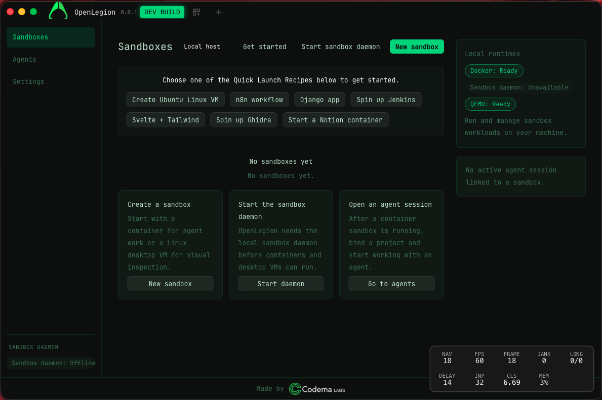

# OpenLegion
[](https://dl.circleci.com/status-badge/redirect/circleci/4HpVvw2oM8fo29s68vV2LJ/7XT7kXBPD4uR5GD5zFRxDT/tree/dev)
[](https://snyk.io/test/github/dorman/OpenLegion)


**A local reverse-engineering workbench — detonate a sample in an isolated sandbox, watch what it does, pull out the artifacts, and get help from a sandboxed AI agent. All on your own machine.**

OpenLegion is where a **malware analyst / reverse engineer** works: spin up an **offline-by-default detonation sandbox** (or a hardware-isolated research VM on a dedicated lab host), run and observe a sample, snapshot/revert to a clean state, open a shell or live desktop into the workload, and extract IOCs and binaries. It picks the isolation level per task — a quick Docker container for a benign sample, a Kata micro-VM with its own guest kernel and no egress for live malware — so runtime is a *safety* choice, not a DevOps one.

**No cloud control plane.** Your samples, images, credentials, and sessions never leave your hardware — which is exactly why this is local, not SaaS. Cloud AI-RE services are a natural [enrichment plug-in](./docs/sandboxes.md#how-it-compares), not a competitor.



## Who it's for

Built for **one** user — the **malware analyst / reverse engineer**. Everything else serves that.

| You want to…                  | What you get                                                                                             |
| ----------------------------- | -------------------------------------------------------------------------------------------------------- |
| **Detonate a sample safely**  | An offline-by-default sandbox — Docker container locally, or a hardware-isolated Kata micro-VM on a no-egress lab host. |
| **Reverse a binary**          | RE desktops (Ghidra + tooling), a live VNC/CDP desktop, an in-sandbox terminal, and one-click snapshot/revert. |
| **Understand what you found** | A permissioned agent whose tools run *inside* the sandbox and can see/drive the desktop.                 |

> **Focus note.** OpenLegion started broader (a general Docker/Kubernetes/VM sandbox platform). It's now deliberately narrowed to RE/security research. The Docker, Kubernetes, and QEMU engines still exist as **isolation options** (demoted under "Advanced" in the UI) — but the product is a **local RE workbench**, not a container manager.

## Quick start

```bash
git clone https://github.com/dorman/OpenLegion.git
cd OpenLegion
bun install

bun run dev:desktop          # the desktop workbench (primary surface)

# macOS: make sure a Docker backend is up (Colima is common)
colima start
```

Stand up a Kata-isolated research host on a dedicated Linux box, then point the app at it:

```bash
sudo ./host-agent/preflight.sh && sudo ./host-agent/setup-kata.sh && sudo ./host-agent/verify.sh
sudo ./host-agent/install-daemon.sh   # runs the sandbox daemon as a LAN service; prints URL + token
```

## Documentation

| Doc | Contents |
| --- | --- |
| [Architecture](./docs/architecture.md) | How it fits together — the daemon, engines, and monorepo layout |
| [Sandboxes](./docs/sandboxes.md) | Sandbox features, the desktop UI, and how it compares to other RE tooling |
| [Requirements & configuration](./docs/configuration.md) | Prerequisites, config paths, and `OPENLEGION_*` environment variables |
| [Development](./docs/development.md) | What's available now, dev/build commands, and the agent + security model |
| [Roadmap](./docs/roadmap.md) | What's done, what's next, and what's been de-emphasized |
| [Research host](./host-agent/) | Turn a sacrificial Linux tower into a Kata-isolated analysis host |
| [Sandbox daemon API](./cmd/openlegion-microvm/README.md) | The daemon's HTTP control plane |

## License & attribution

MIT — see [LICENSE](./LICENSE). OpenLegion is a fork of [OpenCode](https://github.com/anomalyco/opencode) (also MIT; attribution appreciated), diverging toward a local RE workbench with security-aware agents. Not affiliated with Docker Inc. or OpenCode. Third-party projects with "opencode" in the name are unrelated.

Contributions welcome — see [CONTRIBUTING.md](./CONTRIBUTING.md).
