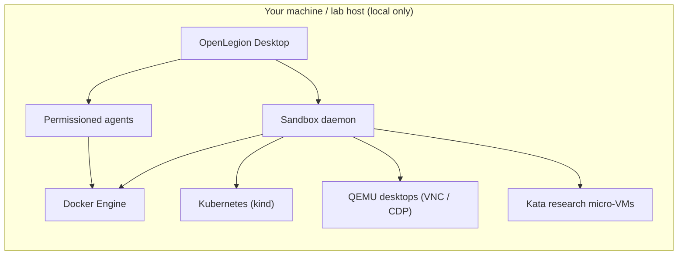

# Architecture

How OpenLegion is put together. For what it is and why, start with the [README](../README.md).



The daemon picks an engine per sandbox: Docker for containers, `kind` for Kubernetes workloads, QEMU for desktop VMs, and Kata for hardware-isolated research VMs.

1. **Desktop-first** — The Electron app (`bun run dev:desktop`) is the primary surface: **Sandboxes**, **Agents**, and **Settings** in one shell.
2. **Isolation levels, chosen per task** — The headline path is RE: an **offline detonation** container or a **hardware-isolated Kata micro-VM** (own guest kernel, no egress) on a dedicated Linux host via the [host-agent scripts](../host-agent/). The same daemon can also run plain **container**, **Kubernetes** (`kind`), and **Linux desktop** (QEMU) sandboxes — kept as advanced isolation options rather than the product's focus.
3. **Isolated runtimes** — The `openlegion-microvm` daemon places Docker workloads on per-sandbox networks, runs Kubernetes workloads as isolated namespaces, hosts QEMU VMs with persisted disks under `~/.openlegion/`, and (on a research host) launches Kata micro-VMs with their own guest kernel on a no-egress network.
4. **Inspect everything** — Logs, embedded shell (containers and Kubernetes pods), a per-sandbox audit log, and an in-app desktop view — VNC for QEMU/research desktops, or a low-latency CDP browser stream for the headless-Chromium image.
5. **Agents inside sandboxes** — Link a host project directory into a container sandbox and run an agent session whose file and shell tools execute **inside** the workload, gated by OpenLegion's permission model. Agents can also **see and drive desktops**: `sandbox_screenshot` and `sandbox_input` capture the screen and send keyboard/mouse over VNC or CDP.
6. **Security by design** — Default-deny tooling, explicit approval for risky operations, and local-only storage of secrets and session history.

## Monorepo layout

```
cmd/
  openlegion-microvm/   # Go sandbox daemon (engine router for Docker / kind / QEMU / Kata)
internal/               # Daemon engines (Docker, Kubernetes, QEMU, Kata), kube client, VNC + CDP display bridge
host-agent/             # Scripts to stand up a Kata-isolated, no-egress research host
packages/
  openlegion/           # CLI, TUI, local HTTP server, agent + tool runtime (incl. VNC/CDP senses)
  core/                 # Shared logic (permissions, DB, providers, …)
  app/                  # SolidJS UI (sandboxes page, desktop shell, dialogs)
  desktop/              # Electron management shell + sandbox runtime IPC
  ui/                   # Components and brand assets
  plugin/               # Plugin SDK
  sdk/                  # JS client for the local API
  sandbox-images/       # Reverse-engineering desktop images (re-desktop, ghidra)
  desktop-image/        # Baked CDP browser desktop (headless Chromium) build
  containers/           # CI images only (not the product runtime)
```

The [`packages/containers`](../packages/containers/) directory is **CI build images** for GitHub Actions only — not the end-user runtime.

Default branch: **`dev`**. Conventions: [AGENTS.md](../AGENTS.md). The sandbox daemon's HTTP API is documented in the [daemon README](../cmd/openlegion-microvm/README.md).
